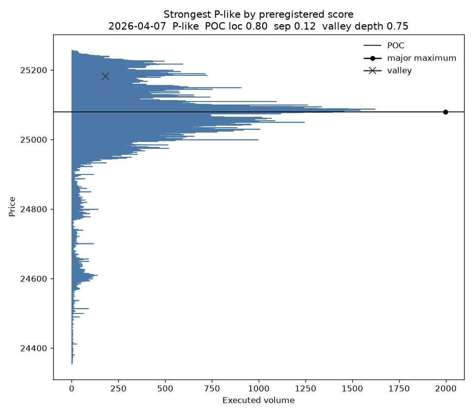
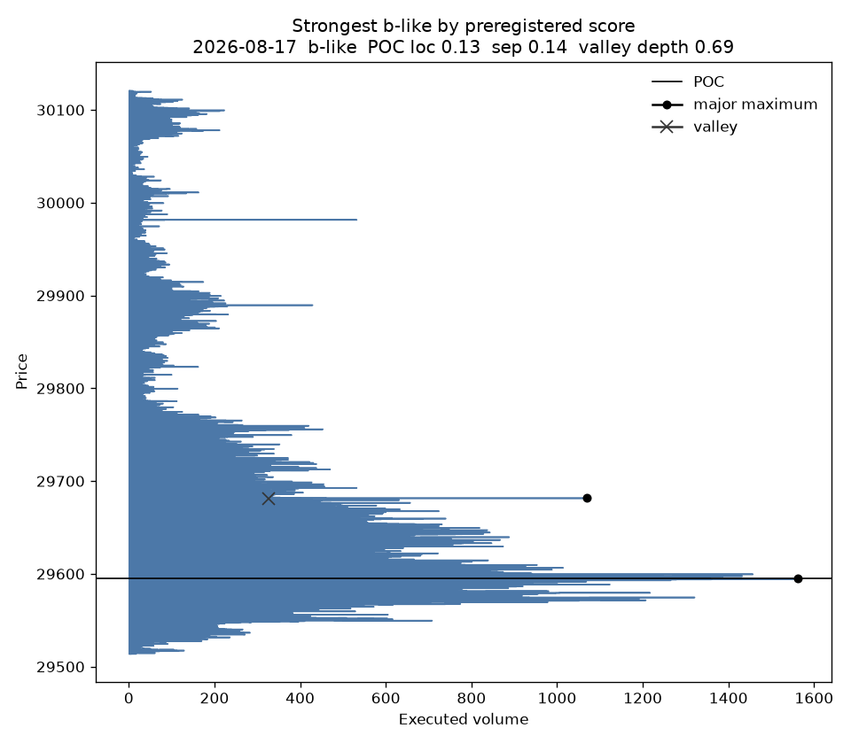
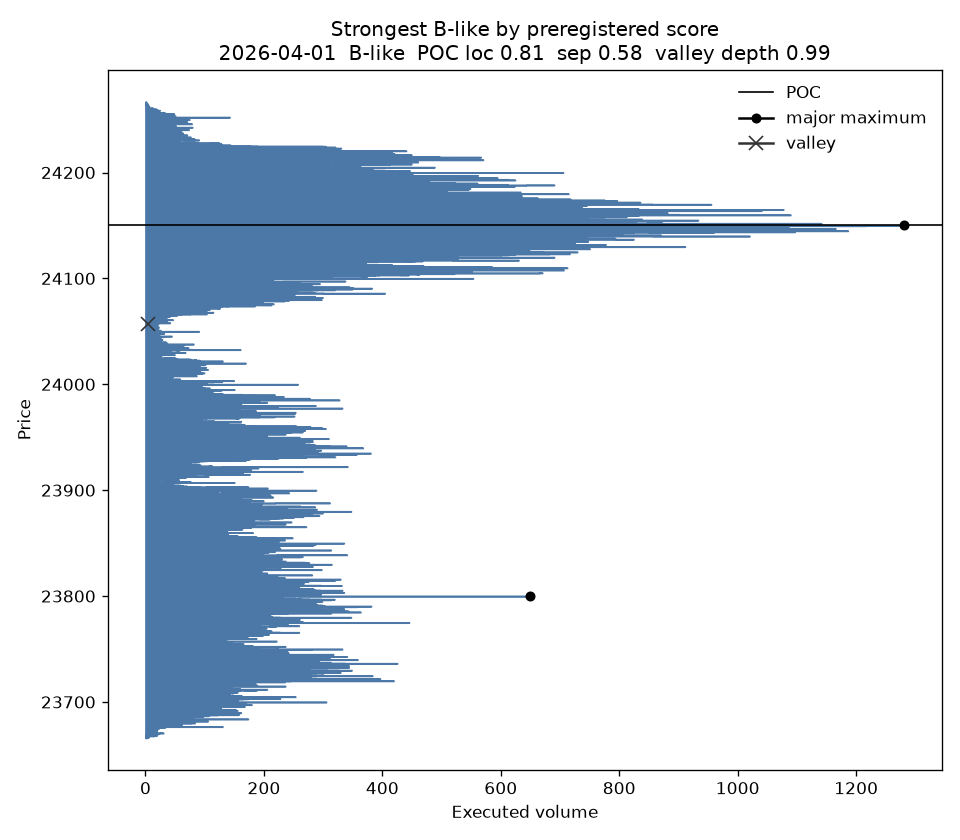
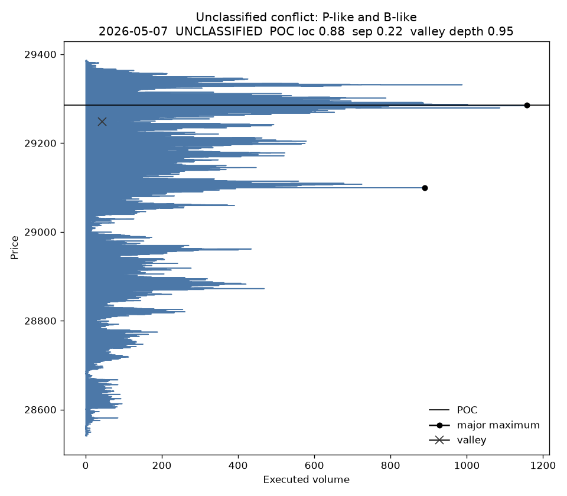

# Step 1 — NQ volume-profile shape geometry

This report does not test profitability, entries, exits, or forward returns.
Class labels were produced by the rules in `PREREGISTRATION.md` and `code/frozen.py`.
Those cutoffs were not moved after the tables below were computed.

## 1. Dataset audit

- Files found: 126 (expected 126).
- Files parsed: 126.
- Failed or unreadable files: 0.
- No file failed to parse.
- Filename span: `trades_24h_2026-03-25.dbn.zst` through `trades_24h_2026-09-16.dbn.zst`.
- Filename span mismatch versus the expected 2026-03-25 to 2026-09-16 set: False.
- First trade timestamp: 2026-03-25 00:00:00.150031609+00:00.
- Last trade timestamp: 2026-09-16 23:59:55.141796351+00:00.
- Total trades: 46124658.
- Total executed volume (positive size only): 64588074.
- Rows repeating `(ts_event, sequence, instrument_id)` inside a file: 5424070. On the first file this key usually groups different prices, so it is not a unique trade id.
- Exact repeated rows on `(ts_event, sequence, instrument_id, price, size)`: 304220. Repeated rows were not removed. Session volume is the sum of every positive size.
- Trade actions: {'T': 46124658}. Every parsed row is an executed trade when the only action is T.
- Consecutive files whose timestamp ranges overlap: 0.
- Rows in an overlap that repeat the previous file's trade key: 0.
- Negative size rows: 0. These rows are not added to volume.
- Sessions assigned: 127.
- Calendar dates with no file between the first and last filename date: 50. The date list is in `results/audit_summary.json`. A missing file date is not deleted from a session that still has trades.
- Sessions whose raw volume does not match the session total: 0.

## 2. Session definition

Timezone is `America/New_York`. A timestamp at or after 18:00 New York belongs to that calendar date. An earlier timestamp belongs to the previous calendar date. Each profile uses every executed trade in `[18:00, next 18:00)`. The economic close is 17:00. The maintenance break stays inside the window and is not filled in.

A session is complete when the first trade is within 30 minutes after 18:00 and the last trade is within 30 minutes before 17:00 the next New York day. A roll is an instrument-id change, more than one instrument id in the session, or a gap of at least 150 points between the previous session's last trade and this session's first trade. The first session is a roll only if it contains two instrument ids.

- Complete sessions: 96.
- Roll-transition sessions: 13.
- Analysis sample (complete, not a roll, positive volume and range, no symbol/file/range failure): 96.
- No complete session is a roll transition, so the analysis sample is exactly the complete sessions.

Incomplete sessions, roll sessions, and corrupt sessions remain in `results/profile_shape_dataset.parquet`. They are excluded from the primary counts, the monthly table, the sensitivity agreement, and the shape examples. That exclusion was declared before classification.

## 3. Profile construction

Volume is the sum of executed trade size at each 0.25-point NQ tick. Databento prices with absolute value above 1,000,000 are divided by 1e9 before rounding to the tick. Bars, quotes, and the book are not used. Untraded ticks between the lowest and highest traded price are stored with volume 0. The series is not smoothed.

Raw rows, including a running cumulative volume from the low, are in `results/raw_price_volume.parquet`.

## 4. Exact mathematical definitions

Let `k = 0 .. R` be ticks from the low, volume `v_k`, total `V`. `R = 0` is degenerate and is not classified.

- POC is the smallest `k` with maximum `v_k`. POC location is `k / R`.
- Volume-weighted mean and population standard deviation are moments of this price distribution. They are saved so sessions can be compared. They are not an intraday VWAP and they are not inputs to the class rules.
- Above-share is volume strictly above the midpoint divided by volume strictly above plus strictly below. The midpoint tick, when `R` is even, is excluded from both sides.
- A 10% tail width is the smallest fraction of the range, walking inward from that extreme, that accumulates at least 10% of `V`. A wider tail is thinner volume.
- Upper-body share is volume at prices at or above `high - 30% of range`. Lower-body share uses the bottom 30%.
- POC concentration is volume within `max(10% of range, one tick)` of the POC, divided by `V`.
- Local maxima use `find_peaks` on the raw grid after flat peaks are represented by their lower-price edge. Baseline prominence is 20% of POC volume. Baseline separation is 10% of `R`, and at least one tick.
- A maximum is major when its volume is at least 50% of POC volume. The POC is kept if the distance filter drops it.
- For the two largest local maxima, ordered with peak 1 at the lower price: `normalized_separation = |peak2 - peak1| / range`, `valley_ratio = V_valley / V_min_peak`, `valley_depth = 1 - valley_ratio`. The valley is the minimum original volume strictly between the peaks. Ties use the tick closest to the midpoint, then the lower tick.

## 5. Classification rules

Flags may overlap. Primary label is the single true flag. Zero flags, or two or more flags, are `UNCLASSIFIED`. Two or more flags also set `conflict`. Three or more major peaks set `flag_multimodal` and do not receive the B-like flag.

- P-like: POC location ≥ 0.70, above-share ≥ 0.62, lower tail − upper tail ≥ 0.20, upper-body share ≥ 0.55.
- b-like: POC location ≤ 0.30, below-share ≥ 0.62, upper tail − lower tail ≥ 0.20, lower-body share ≥ 0.55.
- D-like: POC location in [0.40, 0.60], |above-share − 0.50| ≤ 0.10, |upper tail − lower tail| ≤ 0.12, exactly one major peak, POC concentration ≥ 0.45.
- B-like: exactly two major peaks, normalized separation ≥ 0.20, valley depth ≥ 0.30.

P is not treated as bullish, b is not treated as bearish, and D is not treated as neutral.

## 6. Number of profiles in each class

Primary labels on the analysis sample:

| Primary label | Sessions | Share |
| --- | ---: | ---: |
| P-like | 1 | 1.0% |
| b-like | 2 | 2.1% |
| D-like | 0 | 0.0% |
| B-like | 7 | 7.3% |
| UNCLASSIFIED | 86 | 89.6% |
| Total | 96 | 100% |

Overlapping flags on the analysis sample. These counts are not exclusive.

| Flag | Sessions | Share of analysis sample |
| --- | ---: | ---: |
| P-like geometry | 4 | 4.2% |
| b-like geometry | 2 | 2.1% |
| D-like geometry | 0 | 0.0% |
| B-like / two major peaks with a valley | 10 | 10.4% |
| Three or more major peaks | 57 | 59.4% |
| Two or more shape flags | 3 | 3.1% |

Sessions with both a P-like flag and a B-like flag: 3.
Sessions with both a b-like flag and a B-like flag: 0.

How many analysis sessions pass each clause on its own. A primary label still requires the whole clause list. These counts are not a second classifier.

| Clause | Sessions | Share |
| --- | ---: | ---: |
| P: POC in the top 30% of the range | 32 | 33.3% |
| P: at least 62% of sided volume above the midpoint | 33 | 34.4% |
| P: lower tail at least 0.20 wider than the upper tail | 14 | 14.6% |
| P: at least 55% of volume in the top 30% of the range | 11 | 11.5% |
| b: POC in the bottom 30% of the range | 17 | 17.7% |
| b: at least 62% of sided volume below the midpoint | 18 | 18.8% |
| b: upper tail at least 0.20 wider than the lower tail | 6 | 6.2% |
| b: at least 55% of volume in the bottom 30% of the range | 3 | 3.1% |
| D: POC between 40% and 60% of the range | 28 | 29.2% |
| D: above-share within 0.10 of one half | 36 | 37.5% |
| D: tail widths within 0.12 | 55 | 57.3% |
| D: exactly one major peak | 7 | 7.3% |
| D: at least 45% of volume in the POC band | 17 | 17.7% |
| B: exactly two major peaks | 32 | 33.3% |
| B: normalized separation at least 0.20 | 44 | 45.8% |
| B: valley depth at least 0.30 | 96 | 100.0% |

Primary labels on every saved session, including incomplete and roll sessions:

| Primary label | Sessions | Share |
| --- | ---: | ---: |
| P-like | 3 | 2.4% |
| b-like | 2 | 1.6% |
| D-like | 0 | 0.0% |
| B-like | 9 | 7.1% |
| UNCLASSIFIED | 113 | 89.0% |
| Total | 127 | 100% |

## 7. Shape distributions

The file set runs from late March 2026 through 16 September 2026. These frequencies are not a claim about long-term NQ behavior.

- Analysis sessions: 96.
- Median profile range: 505.88 points.
- Median POC location: 0.572 (0 at the low, 1 at the high).
- Median normalized separation, among analysis sessions with at least two local maxima (n=96): 0.180.
- Median valley depth on that same subset: 0.839.
- Median number of major peaks: 3.00.

Major-peak counts on the analysis sample:

| Major peaks | Sessions |
| ---: | ---: |
| 1 | 7 |
| 2 | 32 |
| 3 | 21 |
| 4 | 23 |
| 5 | 8 |
| 6 | 5 |

By month, analysis sample only:

| Month | Sessions | P-like | b-like | D-like | B-like | Unclassified | Median range | Median POC location | Median separation | Median valley depth |
| --- | ---: | ---: | ---: | ---: | ---: | ---: | ---: | ---: | ---: | ---: |
| 2026-03 | 4 | 0 | 0 | 0 | 1 | 3 | 700.8 | 0.54 | 0.16 | 0.95 |
| 2026-04 | 17 | 1 | 0 | 0 | 1 | 15 | 443.8 | 0.60 | 0.16 | 0.87 |
| 2026-05 | 16 | 0 | 0 | 0 | 0 | 16 | 512.6 | 0.60 | 0.23 | 0.76 |
| 2026-06 | 16 | 0 | 1 | 0 | 1 | 14 | 720.0 | 0.61 | 0.15 | 0.91 |
| 2026-07 | 17 | 0 | 0 | 0 | 3 | 14 | 663.8 | 0.55 | 0.17 | 0.86 |
| 2026-08 | 17 | 0 | 1 | 0 | 1 | 15 | 408.8 | 0.54 | 0.13 | 0.74 |
| 2026-09 | 9 | 0 | 0 | 0 | 0 | 9 | 340.0 | 0.42 | 0.19 | 0.76 |

Median separation and valley depth in a month use only that month's analysis sessions that have at least two local maxima. A dash means that month has none.

## 8. Double-distribution statistics

Analysis sessions with at least two prominence-qualified local maxima: 96 (100.0%).
Exactly two major peaks: 32.
Three or more major peaks: 57.
Primary B-like labels: 7.

On analysis sessions with at least two local maxima:

- Median peak separation: 100.00 points.
- Median normalized separation: 0.180.
- Median valley ratio: 0.161.
- Median valley depth: 0.839.
- Median peak balance (smaller / larger): 0.802.

The same medians on the primary B-like subset:

- Sessions: 7.
- Median normalized separation: 0.294.
- Median valley depth: 0.982.
- Median peak balance: 0.699.

Valley depth uses the unsmoothed grid, so a one-tick hole can make a deep valley next to a small second peak. The major-peak rule, volume at least half of the POC, is what stops that hole from becoming a B label. Depth by itself is not treated as a double distribution.

Node prices and volumes for every session are in `results/nodes.parquet` and in the JSON columns of the session dataset.

## 9. Sensitivity analysis

Only prominence and separation move. The P, b, D, and valley cutoffs stay at the preregistered values.

| Setting | Prominence | Separation | Agreement with baseline | P-like | b-like | D-like | B-like | Unclassified |
| --- | ---: | ---: | ---: | ---: | ---: | ---: | ---: | ---: |
| looser | 0.12 | 0.06 | 0.917 | 3 | 2 | 0 | 1 | 90 |
| baseline | 0.20 | 0.10 | 1.000 | 1 | 2 | 0 | 7 | 86 |
| stricter | 0.30 | 0.15 | 0.885 | 1 | 2 | 0 | 18 | 75 |

Baseline versus looser agreement: 0.917.
Baseline versus stricter agreement: 0.885.

Label changes, analysis sample, baseline to looser:

- B-like -> UNCLASSIFIED: 6
- UNCLASSIFIED -> P-like: 2

Label changes, analysis sample, baseline to stricter:

- UNCLASSIFIED -> B-like: 11

Full-label agreement stays at or above 70% on both settings. Most of that agreement is sessions that stay unclassified.

The B-like count itself does not sit still: looser 1, baseline 7, stricter 18.
11 sessions move from unclassified to B-like when the extrema rule is tightened. At the baseline they have 3 to 4 major peaks, so they miss the exactly-two-peak rule until a stricter prominence drops the extra peaks.
6 baseline B-like sessions move to unclassified when the extrema rule is loosened.
The double-distribution count moves with that small setting change. Most other labels do not, which is why full-label agreement stays high.
The D-like count stays at zero in all three settings.

## 10. Visual examples

Plots use one color for every class. The title is the algorithm's label. Random draws use NumPy seed 42. They are not a hand-picked gallery.

Strongest P-like: 2026-04-07.

Strongest b-like: 2026-08-17.

Strongest D-like: not drawn. No analysis-sample session has this primary label.

Strongest B-like: 2026-04-01.

Unclassified because two shape flags are both true: 2026-05-07.

Random draws:

- P-like: 2026-04-07 (`results/figures/random_P_like_1.png`)
- b-like: 2026-06-22 (`results/figures/random_b_lower_1.png`)
- b-like: 2026-08-17 (`results/figures/random_b_lower_2.png`)
- D-like: no analysis-sample session.
- B-like: 2026-06-29 (`results/figures/random_B_double_1.png`)
- B-like: 2026-07-08 (`results/figures/random_B_double_2.png`)
- B-like: 2026-08-03 (`results/figures/random_B_double_3.png`)
- UNCLASSIFIED: 2026-04-15 (`results/figures/random_UNCLASSIFIED_1.png`)
- UNCLASSIFIED: 2026-04-30 (`results/figures/random_UNCLASSIFIED_2.png`)
- UNCLASSIFIED: 2026-07-27 (`results/figures/random_UNCLASSIFIED_3.png`)

Plots not drawn:
- no analysis-sample session with primary label D-like

## 11. Data-quality issues

- Incomplete sessions: 31. They stay in the dataset and out of the analysis sample.
- Roll-transition sessions: 13. Dates: 2026-04-12, 2026-04-19, 2026-05-24, 2026-06-07, 2026-06-14, 2026-06-18, 2026-06-21, 2026-06-28, 2026-07-12, 2026-07-26, 2026-08-02, 2026-08-30, 2026-09-13.
- Sessions with a file-level problem (unexpected symbol, tick rounding above 1e-4, or a negative size): 0.
- Corrupt ranges above 500,000 ticks: 0.
- Non-contiguous raw grids: 0.
- Degenerate profiles: 0.

Primary labels on roll-transition sessions only:

| Primary label | Sessions | Share |
| --- | ---: | ---: |
| P-like | 2 | 15.4% |
| b-like | 0 | 0.0% |
| D-like | 0 | 0.0% |
| B-like | 0 | 0.0% |
| UNCLASSIFIED | 11 | 84.6% |
| Total | 13 | 100% |

Primary labels on incomplete sessions only:

| Primary label | Sessions | Share |
| --- | ---: | ---: |
| P-like | 2 | 6.5% |
| b-like | 0 | 0.0% |
| D-like | 0 | 0.0% |
| B-like | 2 | 6.5% |
| UNCLASSIFIED | 27 | 87.1% |
| Total | 31 | 100% |

A contract roll can open a price gap and create a false valley. That is why rolls are flagged and kept out of the analysis sample rather than used as evidence of a double distribution.

## 12. Limitations

The sample is about six months, March through mid-September 2026, not a multi-year NQ record. Shape frequencies here should not be quoted as the long-run mix.

The class rules are round structural cutoffs chosen before this run. They were not fit to maximize how many sessions look like a textbook picture. Many sessions are allowed to stay unclassified. A profile can carry two flags; it is then unclassified rather than forced into one name.

Local peaks use prominence and a minimum separation, which is a definition choice, not a smoother. The sensitivity section is the check on that choice. No ATR, VWAP filter, previous-day direction, order-flow feature, entry, stop, target, or forward return enters the label.

The verdict rule, also frozen beforehand, calls the structure clear only when each named class has at least 8 analysis sessions, both sensitivity agreements are at least 85%, and the unclassified share is below 60%. It calls the structure weak when that fails but at least 2 named classes have at least 5 sessions and both agreements are at least 70%. Otherwise there is no clear structure.

### NO CLEAR STRUCTURE

The textbook categories cannot be reliably separated using objective profile geometry.
